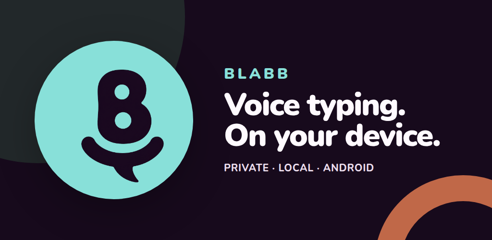
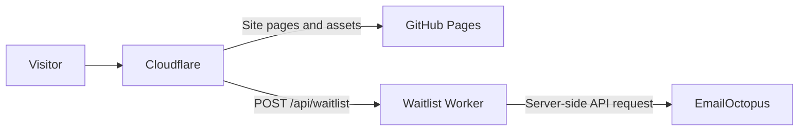

<p align="center">
  <a href="https://blabb.co/">
    
  </a>
</p>

# Blabb.co

The official website for **Blabb**, private offline voice typing for Android.
Blabb floats beside the keyboard a person already uses, records only when asked,
processes speech on the device, and inserts the finished text at the active
cursor.

<p align="center">
  <strong><a href="https://blabb.co/">View the live experience at blabb.co →</a></strong>
</p>

<p align="center">
  <a href="https://blabb.co/privacy/">Privacy</a> · <a href="https://blabb.co/terms/">Terms</a>
</p>

> [!NOTE]
> This repository contains the public product website and waitlist service. The
> unpublished Android application is a separate project and its source is not
> included here.

## The experience

The landing page turns Blabb's real interaction model into a continuous,
scroll-driven demonstration. One interactive 3D Android phone stays with the
visitor while the walkthrough moves through six product states.

| Step | Demonstration | What it communicates |
|---:|---|---|
| 01 | Focus | Blabb waits beside a compatible text field and the existing keyboard. |
| 02 | Dictate | A tap starts recording. No speculative transcript appears while the person speaks. |
| 03 | Process locally | The complete recording is processed on the phone after recording stops. |
| 04 | Insert | The final punctuated sentence lands at the active cursor. |
| 05 | Continue or undo | Tap again to continue, or double-tap to remove only Blabb's latest insertion. |
| 06 | Move or snooze | Dock the bubble on either edge, or snooze it for ten minutes. |

The primary artifact is an original Blender-built phone rendered with Three.js.
Its screen is a live canvas texture, not a video or a floating HTML layer. Mouse
and touch rotation, scroll choreography, responsive camera blocking, WebGL
recovery, and a semantic reduced-motion fallback are all part of the shipped
experience.

## Technology

| Area | Implementation |
|---|---|
| Static site | Semantic HTML, CSS, Sass, and Vite 8 |
| 3D artifact | Three.js, one GLB model, and a canvas-rendered phone UI |
| Motion | GSAP, ScrollTrigger, and Lenis |
| Model pipeline | Blender 4.3+ and `tools/generate_phone_model.py` |
| Waitlist | Cloudflare Worker and EmailOctopus API v2 |
| Verification | Node checks and Playwright browser tests |
| Hosting | GitHub Pages behind Cloudflare |

The production request path is deliberately small:



No analytics, advertising SDK, session replay, or third-party form JavaScript is
loaded on the site.

## Local development

### Requirements

- Node.js 24
- npm
- Google Chrome for the current Playwright configuration
- Blender 4.3 or newer only when regenerating the phone model

Install the locked dependencies and start Vite:

```bash
npm ci
npm run dev
```

Open <http://localhost:4174>. The 3D runtime is loaded separately so the core
copy and semantic fallback remain available if WebGL cannot initialize.

### Commands

| Command | Purpose |
|---|---|
| `npm run dev` | Start the Vite development server on port 4174. |
| `npm run build` | Build the production site into `dist/` and copy static hosting files. |
| `npm run preview` | Serve the production build locally on port 4174. |
| `npm run check` | Run static site and waitlist Worker contract checks. |
| `npm run test:e2e` | Run the Playwright interaction and 3D regression suite. |
| `npm run worker:check` | Validate the Worker with a Wrangler dry run. |
| `npm run worker:dev` | Start the Worker development environment. |
| `npm run worker:deploy` | Deploy the waitlist Worker. |

A full local verification pass is:

```bash
npm run check
npm run build
npm run test:e2e
npm run worker:check
```

## Repository map

| Path | Responsibility |
|---|---|
| [`index.html`](index.html), [`styles.css`](styles.css) | Semantic page structure and the non-WebGL visual foundation. |
| [`src/main.js`](src/main.js) | Browser entry point and progressive enhancement boundary. |
| [`src/scene/`](src/scene/) | Three.js renderer, phone scene, screen texture, and scroll timeline. |
| [`src/styles/artifact.scss`](src/styles/artifact.scss) | WebGL artifact layout, responsive behavior, and fallbacks. |
| [`scripts/`](scripts/) | Navigation, semantic demos, use cases, and waitlist interactions. |
| [`assets/phone/blabb-phone.glb`](assets/phone/blabb-phone.glb) | Production Android phone model. |
| [`tools/generate_phone_model.py`](tools/generate_phone_model.py) | Reproducible Blender source for the GLB. |
| [`worker/waitlist.js`](worker/waitlist.js) | Server-side EmailOctopus integration and request protection. |
| [`tests/`](tests/) | Static, Worker, interaction, mobile, and WebGL regression coverage. |
| [`privacy/`](privacy/), [`terms/`](terms/) | Public legal pages built as Vite entry points. |
| [`Branding.md`](Branding.md) | Canonical colors, Nunito requirement, and logo source. |
| [`WEBSITE_REVAMP_PLAN.md`](WEBSITE_REVAMP_PLAN.md) | Design rationale, reference analysis, and implementation record. |

## Regenerating the phone

The committed GLB is generated from code, so changes to the hardware can be
reviewed and reproduced:

```bash
blender --background --python tools/generate_phone_model.py
```

The script writes `assets/phone/blabb-phone.glb`. When changing the model,
commit the generator and its generated GLB together, then run the browser suite
to check geometry, materials, rotation, shadows, and mobile framing.

## Waitlist service

The public form lets a visitor choose the Android beta list or register interest
in an iPhone version. It posts to `/api/waitlist`, where the Cloudflare Worker
upserts the address into EmailOctopus with these tags:

- Every signup: `source_blabb_waitlist`
- Android: `platform_android`
- iPhone: `platform_ios`

The Worker intentionally omits contact status. New contacts follow the
EmailOctopus list's double opt-in setting, while an existing unsubscribe remains
unsubscribed.

The endpoint also:

- accepts only the configured production origins;
- validates content type, payload size, email, and platform;
- quietly absorbs honeypot submissions;
- rate-limits each client to six attempts per minute;
- keeps the EmailOctopus credential out of the browser and repository;
- does not maintain a separate email database or log submitted addresses.

### Deploying the Worker

Authenticate with Cloudflare, store the API key as a secret, validate, and
deploy:

```bash
npx wrangler login
npx wrangler secret put EMAILOCTOPUS_API_KEY
npm run worker:check
npm run worker:deploy
```

Enter the API key only at Wrangler's private prompt. Never place it in a source
file, shell argument, issue, commit, or chat message. The list ID, allowed
origins, production routes, and rate-limit binding are declared in
`wrangler.jsonc`.

## Deployment

Pushing `main` triggers `.github/workflows/pages.yml`. The workflow uses Node 24,
installs from `package-lock.json`, runs the static checks, builds `dist/`, and
deploys it to GitHub Pages. Worker changes are deployed separately with
`npm run worker:deploy`.

Cloudflare proxies the public domain. Normal site traffic continues to GitHub
Pages, while only `/api/waitlist` is handled by the Worker.

## Product and design guardrails

- `Branding.md` is the source of truth for the palette, Nunito, and canonical
  Blabb artwork.
- The current app is accuracy-first and full-context. Do not show words arriving
  while recording is still in progress.
- Product demonstrations must preserve the real lifecycle: ready, listening,
  processing, inserting, success.
- The site must remain useful without JavaScript, WebGL, or animation.
- Product claims must be checked against the current Android app before release.
- Waitlist messaging must not imply that Blabb requires an account.
